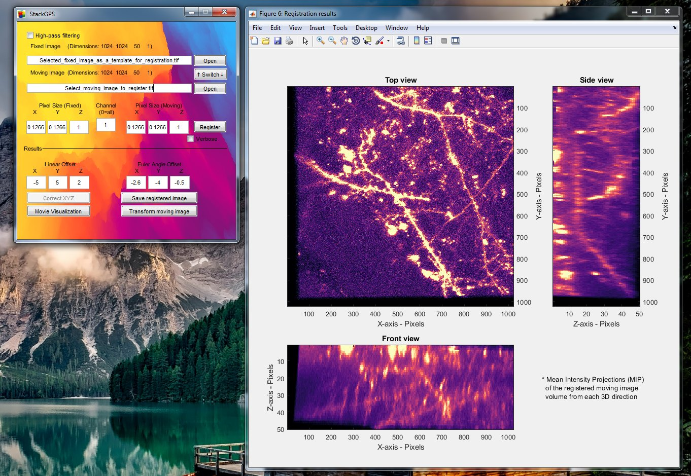

# StackGPS v1.3 #
### Ingie Hong @ Johns Hopkins Medical Institute, 2017 ###

For the rigid registration of 2D or 3D image stacks and visualization of the results.
Particularly useful when trying to keep a microscopic sample in identical 
orientation across multiple days, as in *in vivo* two-photon imaging.
A reference image (either 2D or 3D z-stack) taken on the first day will allow 
accurate registration of subsequent day images, and guide the movement/rotation
required for alignment of the sample.

Sister hardware designs for rodent head fixation rigs are available: [Go^2-stages on Github](https://github.com/ingiehong/Gogo-stages)

**Installation**:

	1. Install elastix v4.X (http://elastix.isi.uu.nl/)
		(set PATH to elastix folder, and check accessibility to elastix and transformix at command prompt)
	2. Install elastix wrapper (https://github.com/rcasero/gerardus but please use fork https://github.com/ingiehong/gerardus.git for sustained compatibility)
		(add ElastixToolbox and FileFormatToolbox to MATLAB path)
	3. Install StackGPS (and add to MATLAB path)
	4. If you need Scanimage TIF support, download scim_openTif.m and parseHeader.m from the 3.8 release or make scanimage.util.opentif available from later versions (http://scanimage.vidriotechnologies.com/display/SIH/ScanImage+Home).
	5. For image file formats other than TIF, download OME BIO-FORMATS Matlab toolbox (https://www.openmicroscopy.org/bio-formats/) and add to MATLAB path.

**Getting Started**:

	0. Run stackGPS (without any arguments this function loads the GUI but it also can be used as the main command prompt function)
	1. Set options including voxel size and high-pass filtering
	2. Load fixed image and moving image to register
	3. Press register button to initiate registration
	4. Physically apply resulting shift recommendations and acquire another moving image. Go to 2 and repeat registration.
	
	- Alternative command-line workflow
	1. Use demo_startGPS.m script to quickly start aligning images.
 	2. compare3D allows easy visualization of the 3D alignment.
	3. When a reference image is already loaded, use the demo_continueGPS.m script to load just a moving image.
	4. For batch registration of multiple moving images to one fixed image, start with the demo_stackGPS_batch.m script.
        
**App pseudocode**:

	1. Open moving target image (2D or 3D Moving)
	2. Open reference Z-stack (2D or 3D Fixed)
	3. Run elastix (rigid registration mode) to either: 
          a.register 2D moving image on to each slice of the 2D or 3D fixed reference image.
          b.register 3D moving image to the 3D fixed reference image.
	4. Check validity of registration and visualize registration.
	5. Present parameters for adjustment of microscope/sample position.

**Later features to work on**:

	1. Automatic positioning for Scanimage/Prariescan
	2. Tilt adjustment (3D to 3D fitting) (done in v1.1)
	3. Multi-resolution image adaptation (done in v1.1)
	4. Plots for fit
	5. Automatic image header reading - for dimension/channel/XYZ spacing information etc. (done in v1.3 through OME)
	6. Option to use a subvolume of the reference image.
	7. Support for multi-channel image registration (done in v1.2)
	8. Create GUI (done in v1.3) 

**Updates**:

	v1.3
	-Added GUI
	-Added image file compatibility through OME BIO-FORMATS
	
	v1.2 
	-Added batch registration mode
	-Added demo scripts and more documentation.

	v1.1
	-Added 3D-to-3D registration
	-Added save_tif.m for simple tif saving.
	-Fixed bug with Elastix parameter file location
	-Optimized Elastix parameters
